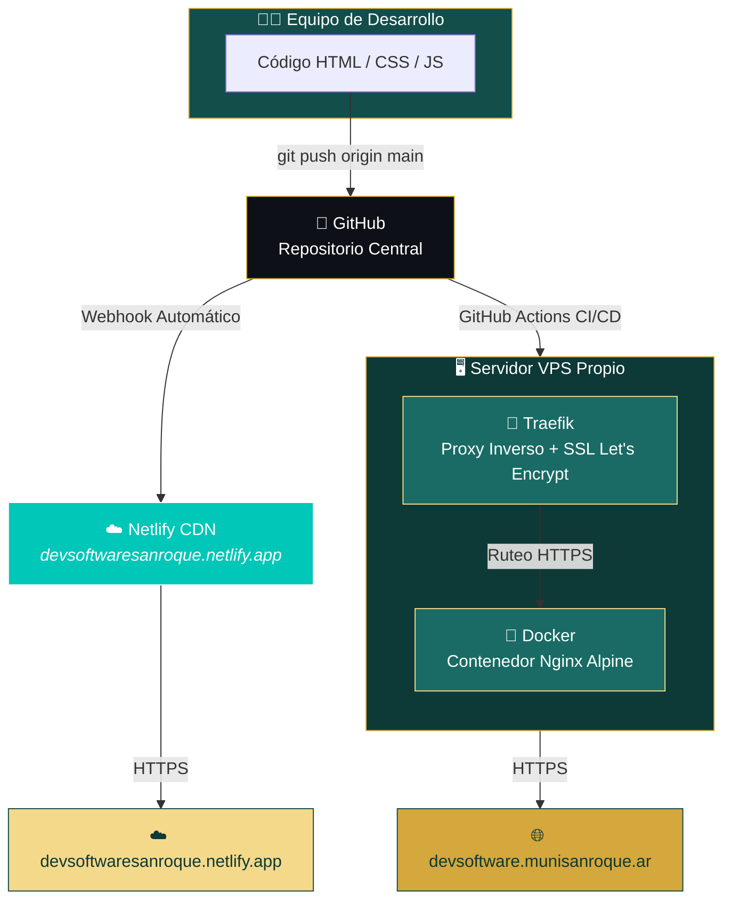

# Portal Municipal de San Roque - Frontend 🌐🏛️

> **Proyecto Oficial de Pasantía de Desarrollo de Software**  
> Interfaz web integral, modular y responsiva para la centralización de información pública, turismo, servicios, deportes y fomento de emprendedores de la **Municipalidad de San Roque, Corrientes**.  
> 🌍 **Sitio Institucional Base:** [munisanroque.ar](https://munisanroque.ar/)

---

## 🚀 Despliegue en Vivo (Alta Disponibilidad)

Este portal cuenta con **dos sistemas de despliegue paralelos e independientes** para garantizar la máxima disponibilidad. Si uno falla o se queda sin crédito, el otro mantiene el portal accesible al público sin interrupciones.

| Canal | URL | Tecnología | Estado |
|:---:|:---|:---:|:---:|
| 🌐 **Primario** | [devsoftware.munisanroque.ar](https://devsoftware.munisanroque.ar) | Docker + Nginx en VPS propio | ✅ Activo |
| ☁️ **Secundario** | [devsoftwaresanroque.netlify.app](https://devsoftwaresanroque.netlify.app/) | Netlify (CDN gratuito) | ✅ Activo |

### 🏗️ Arquitectura de Redundancia y CI/CD



> 💡 **¿Cómo funciona?** Con un solo `git push origin main`, **ambos sistemas se actualizan automáticamente en paralelo**. Netlify detecta el push via webhook y reconstruye la web. Al mismo tiempo, GitHub Actions conecta al VPS, descarga los cambios y reconstruye el contenedor Docker. Todo ocurre en menos de 2 minutos sin intervención humana.

---

## 🎨 Paleta de Colores Oficial (Identidad Visual)
Para garantizar la uniformidad estética del portal, todos los estilos CSS deben regirse estrictamente por las siguientes variables obligatorias:
* 🟢 **Verde Base (`#134e4a`):** Fondo de encabezados, secciones principales y contenedores destacados.
* 🌲 **Verde Oscuro (`#0d3937`):** Fondo de la barra lateral (sidebar) y degradados estructurados.
* 🌿 **Verde Claro (`#1a6b65`):** Botones de acción, acentos de texto y subencabezados secundarios.
* 🟡 **Dorado (`#d4a83c`):** Iconos activos, llamadas a la acción (*Call to Action*) y resaltados.
* 🌟 **Dorado Claro (`#f5d98a`):** Bordes decorativos, líneas divisorias y alertas sutiles.
* 🏐 **Gris de Fondo (`#f4f7f6`):** Fondo general de la aplicación web.
* 🪙 **Gris de Texto (`#4a5568`):** Tipografía de cuerpos de texto y descripciones secundarias.

---

## 🧠 Tutoriales Rápidos desde Cero (Para Principiantes)

Si es tu primera vez trabajando en un entorno real de desarrollo, no te preocupes. Aquí tienes la guía básica para entender las 3 herramientas esenciales de la pasantía:

### 1. 📝 Notion (Gestión de Tareas)
* **¿Qué es?** Es nuestro tablero digital de organización. Allí están listadas todas las necesidades de la web divididas por tarjetas.
* **¿Cómo usarlo?** Al iniciar tu jornada, ingresa al espacio de Notion del equipo. Busca la tarjeta que tenga tu nombre asignado en la columna **"Por Hacer"**, lee los requisitos y arrástrala a la columna **"En Progreso"**. Esto avisa al resto del equipo que ya estás trabajando en ello.

### 2. 🐙 GitHub (Control de Versiones)
* **¿Qué es?** Una nube inteligente donde guardamos el código del software. Evita que borremos sin querer el trabajo de los compañeros y guarda un historial de todo lo que hacemos.
* **Comandos básicos que debes usar en tu consola:**

```bash
# PASO 1: Descargar el proyecto a tu computadora por primera vez (Solo se hace una vez)
git clone git@github.com:RickyFer22/Dev_Software_SanRoque.git

# PASO 2: Sincronizar tu entorno de trabajo antes de empezar a programar cada día
cd Dev_Software_SanRoque
git checkout main
git pull origin main

# PASO 3: Enviar tu trabajo a internet cuando el HTML/CSS/JS ya funcione localmente
git add .
git commit -m "feat: agrega modulo de turismo con gastronomia y contacto"
git push origin main
```

### 3. ⚡ Despliegue Automático (CI/CD)
* **¿Qué es?** Son los servidores que publican la página a internet. Lo mejor de todo es que están **100% automatizados**.
* **¿Cómo funciona?** No tienes que hacer nada manual. En el segundo exacto en el que realizas el comando `git push origin main`, **dos cosas ocurren en paralelo automáticamente:**
  1. **Netlify** detecta tu nuevo código, compila la web y actualiza el sitio en [devsoftwaresanroque.netlify.app](https://devsoftwaresanroque.netlify.app/).
  2. **GitHub Actions** conecta a nuestro servidor VPS propio, reconstruye el contenedor Docker y actualiza el sitio en [devsoftware.munisanroque.ar](https://devsoftware.munisanroque.ar).
* ¡Solo debes esperar un par de minutos e ingresar a cualquiera de las dos URLs para verificar que tu trabajo se vea perfecto!

---

## 📂 Estructura de Módulos (Alcance del Portal)
El sistema web se compone de 6 núcleos aislados que estructuran la información recopilada en el territorio:

* 🌲 **Turismo & Cultura (*Descubrí San Roque*):** Atractivos, museos, carnavales, grilla de la Fiesta Patronal y guías de alojamientos/gastronomía vinculadas a WhatsApp.
* 🏛️ **Dependencia Municipal:** Catálogo de áreas de la municipalidad, funcionarios responsables, horarios de atención y guía de trámites para el ciudadano.
* ⚽ **Deportes:** Fichas de clubes locales, escuelas deportivas, fixtures de torneos activos (Futsal) y visualizador de estado/reserva de canchas.
* 📋 **Servicios a la Comunidad:** Cronograma de recolección de residuos por barrios, directorio de remiserías con tarifas y frecuencias de la Terminal de Ómnibus.
* ⛪ **Culto (*Misas*):** Listado unificado de capillas y parroquias, sacerdotes a cargo y agenda horaria interactiva de celebraciones religiosas.
* 🛍️ **Emprendedores Locales:** Vitrina virtual de la economía social para la visibilización y contacto directo con los productores locales.


## 🐳 Desarrollo con Docker (Opcional)

Para ejecutar el portal localmente en un contenedor Docker idéntico al de producción:

```bash
# Construir y levantar el contenedor (accesible en http://localhost:8080)
docker compose up --build

# Detener el contenedor
docker compose down
```

## 🔄 Flujo Operativo de Trabajo Diario (Obligatorio)
Para mantener la armonía del equipo, tu ciclo de desarrollo diario debe cumplir los siguientes pasos ordenados:

1. Revisa tu asignación en Notion y muévela a **"En Progreso"**.
2. Ejecuta un `git pull origin main` en tu computadora para estar al día.
3. Desarrolla el código usando HTML5 semántico, CSS responsivo y Vanilla JavaScript. Prueba los resultados en tiempo real usando Live Server en tu editor.
4. Asegúrate de que las secciones que programes utilicen las variables de color corporativas (`--verde`, `--dorado`, etc.).
5. Envía tus cambios ejecutando la secuencia de comandos Git (`add`, `commit` y `push`).
6. Espera un par de minutos, ingresa al enlace público de [devsoftware.munisanroque.ar](https://devsoftware.munisanroque.ar) o [devsoftwaresanroque.netlify.app](https://devsoftwaresanroque.netlify.app/) y constata el correcto renderizado de tu módulo.
7. Mueve tu tarjeta en Notion a **"Finalizado"**.

---

*Desarrollado en el marco del acuerdo de pasantías entre el Instituto Superior de Formación Docente "Juan García de Cossio", a través de la Tecnicatura Superior en Desarrollo de Software, y la Municipalidad de San Roque, como parte del proceso integral de modernización y digitalización del Estado municipal.*
